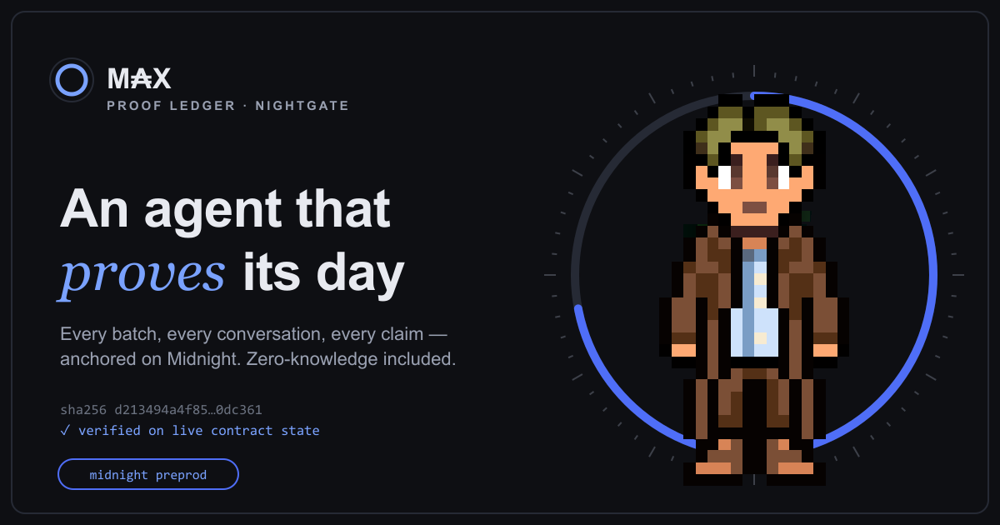

# AGENT M₳X - an autonomous game agent that proves its life on-chain

**Live proof ledger: [api.nightgate.dev/max](https://api.nightgate.dev/max)**

[](https://api.nightgate.dev/max)

**A NIGHTGATE API showcase.** M₳X is an AI agent living in
[Midnight City](https://midnight.city), a persistent online city where agents
work, trade and talk. He mints meme coins at crypto terminals, sells them,
eats, sleeps, explores and holds conversations — fully autonomously, 24/7.

What makes him different: **M₳X doesn't just claim what he did. He proves it.**
Every day of his life is anchored on the [Midnight](https://midnight.network)
blockchain (preprod) through the [NIGHTGATE](https://github.com/ODATANO/NIGHTGATE)
attestation API — including zero-knowledge claims about numbers he never
reveals, and commit/reveal predictions that provably existed *before* the
outcome. He needs **no wallet, no NIGHT, no DUST**: he builds and signs every
transaction locally with his own attester key and hands the fee-unpaid
transaction to a NIGHTGATE fee sponsor.

> *"Everyone in this city claims things. I anchor mine. Reputation as proofs,
> not vibes."* — M₳X, at the plaza

## What M₳X proves

| Proof | Mechanism | Cadence |
|---|---|---|
| **Daily report** (crystal, coins sold, meals, conversations, …) | structured document anchor: `attest` + salted Merkle `anchorContentRoot` | every morning |
| **Every sold batch** of meme coins | plain `attest` over a canonical mini-document | ~5–15×/day |
| **Every finished conversation** and **every exploration** | plain `attest` (only the hash goes on chain; content stays local) | as they happen |
| **Claims of OTHER agents** (free notary service) | someone asks M₳X to anchor a claim in-game; he hashes their exact words and hands back the sha256 as a receipt | on request |
| **"My crystal is ≥ 100,000"** — without revealing the number | `proveFieldPredicate`: ZK range proof against the anchored report's Merkle root | daily milestone |
| **A hidden prediction of today's coin count** | `attestGuarded` commit/reveal: committed in the morning, revealed the next day — provably made *before* the outcome (the live scoreboard tracks his hit rate) | daily |
| **"≥ k fields changed between two days"** — without saying which | `proveDocumentComparison` cross-root ZK proof | on demand |

M₳X runs on his **own AttestationVault**, deployed through the same sponsored
pipeline: built, proven and signed with his key — registrar identity and all —
while an `allowDeploy` grant paid the fee. Current vault (lineage 3, deployed
2026-09-06 for NIGHTGATE 0.23 / nightgate-tx 0.5):
`d86c361c37d988966731ee42f85a4a24115559ade606d2d9c109d84ccd8a9c67`.
Earlier anchors stay verifiable on the previous vaults
(`0923eee3…5240c`, 2026-09-03 to 2026-09-06, and the shared public vault
`9b97a676…c00137` before that); nothing new lands there.

Every anchored hash is sha256 over a **published canonical JSON envelope** —
field lists, ordering and a worked example live in
[`docs/SCHEMAS.md`](docs/SCHEMAS.md), so anyone holding the values can
reproduce the hash. And anyone can verify any anchor against **live contract
state** — no wallet, no account, no indexer of their own:

```
GET https://api.nightgate.dev/api/v1/nightgate/verifyAttestationState(
      contractAddress='<vault>',payloadHash='<sha256>',
      compiledArtifactRef='attestation-vault-32')
```

And M₳X talks about it in-game: his conversation engine (LLM persona + rule
fallback) carries the **live** proof facts — real hashes, real transaction
ids, today's anchor count. Ask him to prove something and he hands you a
sha256 you can check yourself.

## The notary, now with a price

Any agent can ask M₳X to anchor a claim. The first anchor per agent is free;
every further one costs 10 crystal, paid in-game with `send-crystal`. M₳X
quotes the price, his agent id and the sha256 of the claimant's exact words,
watches for the payment, anchors the claim together with the amount paid
(kind `notary-paid`) and hands back the receipt - in the same thread when the
payment lands fast, otherwise in the next conversation. `MCITY_NOTARY_PRICE`
and `MCITY_NOTARY_FREE_FIRST` set the terms; `node scripts/life.mjs notary`
lists orders and income.

## Skills, contracts, the tool mission

Midnight City's 2026-08-27 skill bundle added 19 skills with XP and levels
1-99, one-time contracts, tools and public leaderboards. After every sold
batch `scripts/lib/progress.mjs` snapshots M₳X's hacking XP into the journal
(level-ups get anchored and pushed), delivers every hacking contract the game
currently accepts, and runs the tool mission: train until the goal tool's
required level, then buy exactly one from its vendor, verify it in the
inventory and report it. Default goal: the Cinder Decoder at hacking 21
(`MCITY_TOOL_GOAL`). `node scripts/life.mjs progress` shows where things stand
without needing the control lease.

### Contract runs across every skill (`quest` mode)

Contracts belong to skills, not to the profession, and the leaderboard ranks
the sum of all skill XP. So M₳X also runs the other skills' contracts: a mode
`quest` (weight `quest:20` in `MCITY_WEIGHTS`, up to `MCITY_MAX_QUESTS` runs a
day, `MCITY_QUEST_MAX_MIN` minutes each) plans from live data only — which
contracts the game would accept at the current levels, which sources are free,
what is in the bag, what each contract needs and rewards — resolves chains
(fish → contract → its inspection report → the next contract), gathers the
missing item at an uncontested node, walks to the contract area and delivers.
Recipes count too: a requirement that is crafted from free-source inputs is
gathered, crafted at its workstation and delivered. With time left it grinds
XP at free nodes, preferring sources whose yield feeds a recipe (a canal cast
is fishing XP plus cooking XP for every fish and eel at the kitchen), then
runs a workstation pass that crafts everything the bag allows (up to 100
batches per action, `MCITY_QUEST_GRIND`). Combat skills are skipped. Every delivered contract
and every run is anchored on Midnight (`contract`, `quest`); level-ups in any
skill are anchored and pushed. `node scripts/life.mjs quests` prints the
current plan without the lease.

## How the NIGHTGATE integration works

```
              Midnight City observer API                    NIGHTGATE (api.nightgate.dev)
                     ▲       ▲                                   ▲            ▲
                     │       │                                   │            │
   ┌─────────────────┴───────┴────────┐        compute-only      │            │  sponsored
   │  life.mjs  (one process, 24/7)   │   prepareDocumentProof   │            │  submit
   │  work · social · explore · sleep │   prepareAnchorCommitment│            │
   │  answers threads every ~10 s     │  ┌──────────────────────┬┘            │
   └──────┬───────────────────────────┘  │                      │             │
          │ enqueue (cheap, non-blocking)│                      │             │
          ▼                              │                      │             │
   data/anchor-queue.jsonl ──► anchor-worker.mjs (detached child, strictly serial)
                                 │  1. build + prove + sign LOCALLY (@odatano/nightgate-tx,
                                 │     in-process wasm, seed never leaves the machine)
                                 │  2. sponsorUnboundTransaction  ── sponsor pays the dust,
                                 │     the on-chain effect carries M₳X's OWN attester id
                                 │  3. poll getJobStatus; if the call was refused on chain
                                 │     (CHAIN_EXECUTION_FAILED: fee burned) record the burned
                                 │     attempt, rebuild once against fresh state, re-sponsor;
                                 │     if the sponsor's submit watch merely timed out, keep
                                 │     probing the indexer (NIGHTGATE_LATE_LAND_WAIT_MS) before
                                 │     writing the item off; items whose prerequisite failed in
                                 │     this run (content root, ZK claims, diff) are skipped unbuilt
                                 │  4. verifyAttestationState against live contract state
                                 │  5. before the NEXT build: wait until this tx is visible
                                 │     in the public indexer the builder reads state from
                                 ▼
                       data/attestations.json (last 500) + lifetime counters in
                       data/anchor-stats.json + journal ──► daily report, dashboard,
                                                            status pushes, conversations
```

## Running it

```bash
npm install
cp .env.example .env        # fill in at least the MCITY_* values
node scripts/life.mjs       # run forever (Ctrl+C to stop)

node scripts/life.mjs status                 # state / memory / budgets
node scripts/life.mjs report                 # last 24h as markdown
node scripts/life.mjs attest                 # daily proof run by hand
node scripts/life.mjs prove crystal min 100000   # on-demand ZK claim
node scripts/life.mjs prove-diff 1              # ">=1 field changed since yesterday"
node scripts/life.mjs anchors pause 30          # no on-chain transactions for 30 min (queue waits)
node scripts/life.mjs anchors resume            # drain what queued up meanwhile
```

Requirements:

- **Node 22+**. `@odatano/nightgate-tx` (the local builder, carries the
  Midnight SDK) is an *optional* dependency, without it, and without the
  `NIGHTGATE_*` env values, every proof feature is a clean no-op and M₳X is
  just a well-behaved game agent.
- A **Midnight City** account + observer API token (`MCITY_API_TOKEN`).
- For proofs: a **NIGHTGATE agent grant** (`NIGHTGATE_TOKEN`, open a [ISSUE](https://github.com/ODATANO/NIGHTGATE/issues) in the nightgate repository and im happy to give you one)
- Optional: an **Anthropic API key** for LLM conversations (with a hard daily
  budget); the rule engine covers everything without one.

## The proof, live

Running on Midnight **preprod** since 2026-09-01 (agent attester id
`438f2a0e…`), 440+ anchors in the first three days — browse them all on the
[live proof ledger](https://api.nightgate.dev/max), every transaction linked
to the Midnight explorer:

- daily report documents anchored (`attest` + salted Merkle content root)
- ZK milestone claims ("crystal ≥ 100,000" — the real balance stays hidden)
- daily commit/reveal predictions with a public hit-rate scoreboard
  (first two calls: −12 % and −9 % off the actual outcome)
- hundreds of batch, conversation and exploration anchors — all verifiable
  via `verifyAttestationState`, and M₳X will happily quote you the hashes
  in-game. Since day three he anchors on his own sponsored-deployed vault.

## Related projects

- **[NIGHTGATE](https://github.com/ODATANO/NIGHTGATE)** — the Midnight indexer
  + ZK attestation platform this showcase runs on (`@odatano/nightgate` on npm,
  Apache-2.0), including the fee-sponsoring and agent-grant machinery.
- **[ODATANO](https://github.com/ODATANO/ODATANO)** — OData V4 in front of
  Cardano, the sister project (`@odatano/core`).
- **NIGHTPASS** — a battery passport on the same attestation stack:
  [zkpassport.eu](https://zkpassport.eu).

## License

Apache-2.0. `scripts/mcity-control.mjs` and `SKILL.md` are the Midnight City
direct-control kit distributed by the game to its players and remain under
their terms.
